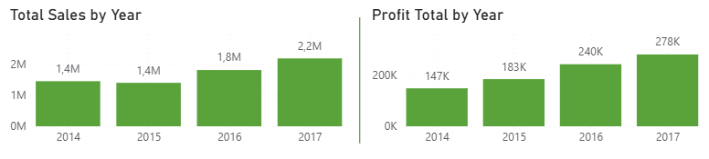
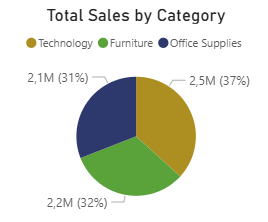
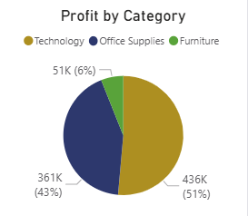
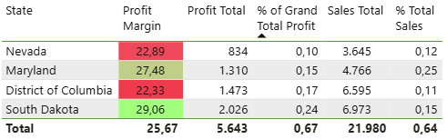

# 📊 Superstore Dataset Analysis Report

## Abstract
This analysis explores sales, profitability, and operational trends within the Superstore dataset using Power BI. It focuses on identifying high-performing product categories and customer segments, uncovering underperforming regions and SKUs, and evaluating the impact of discounts and shipping methods on profit margins. Key visualizations and metrics guide strategic recommendations for improving profitability, optimizing product bundling, and refining discount strategies. The report is designed to support data-driven decision-making and performance optimization for retail operations.

## Dataset Description
The Superstore dataset contains approximately 30,000 records of orders from a fictional retail company over a 4-year period (2014–2017). The dataset includes the following key fields:

- Order and ship dates

- Product category, sub-category, and name

- Sales, profit, discount, and quantity

- Customer details (ID, name, segment)

- Regional information (region, state, city)

- Shipping mode and delivery details

This dataset is widely used for sales analytics and dashboarding practice, offering a comprehensive overview of retail operations across multiple business dimensions.

## 📚 Table of Contents
[🔗 View Interactive Power BI Report](https://app.powerbi.com/view?r=eyJrIjoiZDI5MWI5OGQtMmIyNy00YjVjLTgxNDItZDJmMWQ1MTVkODU2IiwidCI6IjRiMzI5MDRlLTM3NDAtNDRlYi04YTM2LTE1OTQ3MDE0MzNjOCIsImMiOjl9&pageName=aa1d03d8fa078633a90f)

1. [Executive Summary](#1-executive-summary)
2. [Category & Product Performance](#2-category--product-performance)
3. [Shipping Mode Insights](#3-shipping-mode-insights)
4. [Segment & Customer Performance](#4-segment--customer-performance)
5. [Regional & State-Level Performance](#5-regional--state-level-performance)
6. [Discounts vs. Profitability](#6-discounts-vs-profitability)
7. [Final Recommendations](#7--Final-Recommendations)

## 1. Executive Summary

- Compound Annual Growth Rate (CAGR):
    - Sales: +14%
    - Profit: +24%
      
  
- Total Sales: $6.82M
    - Technology: $2.5M (37%)
    - Office Supplies: $2.1M (31%)
    - Furniture: $2.2M (32%)
     
     
- Total Profit: $849K
    - Technology: $436K (51%)
    - Office Supplies: $361K (43%)
    - Furniture: $51K (6%)
  
  
- Top Performing States: California & New York (~40% of total profit)
 
  
- Under-performing Regions: Central & South
- 18.7% of sales were unprofitable, totaling a loss of $463.5K
 
  

---

## 2. Category & Product Performance

🟢 High Profitability Subcategories:

- Copiers: 20% of the total profit comes from only 1% of orders
- Phones, Accessories, and Paper collectively drive 60% of total profit
- Labels, Paper & Envelopes show excellent margins despite lower overall profit

  

🔴 Under-performing Subcategories:

- Furniture generates 32% of sales but only 6% of profit
- Tables, Bookcases, Machines, and Supplies often result in negative profit
- Nearly 50% of total losses stem from Binders, Tables, and Machines
  
  

### 💡 Recommendations:

- Limit or eliminate discounts on high-sales, low-margin items (e.g., Binders)
- Consider bundling low-performing products with high-margin ones:
    - Tables with Chairs
    - Bookcases with Binders or Paper
    - Supplies with Envelopes or Paper
- Phase out consistently unprofitable products

---

## 3. Shipping Mode Insights

- Standard Class: 60% of shipments – most cost-effective
- Second Class: 20%
- First Class: 15%
- Same-Day: 5% – low usage and profitability

  

### 💡 Recommendation:

- Prioritize Standard Class for most orders. Use Same-Day shipping selectively (e.g., premium customers or urgent orders).

---

## 4. Segment & Customer Performance

- Segment Share of Sales:
    - Consumer: 3.5M (50%)
    - Corporate: 2.1M (30%)
    - Home Office: 1.3M (19%)
- 20% of customers are unprofitable
- Several high-revenue customers yield little or negative profit
  
  

### 💡 Recommendation:

- Review discount policies and servicing costs for unprofitable customers.

---

## 5. Regional & State-Level Performance

### States with the Poorest Profit Margins:

🔻 North Carolina (6th in sales overall, yet major margin issues):

- Machines: −32%
- Binders: −17%
- Tables: −6%

🔻 Arkansas

- Binders: −63%
- Tables: −18%

🔻 Oregon

- Binders: −155%
- Machines: −109%

🔻 Florida

- Binders: −17%
- Tables: −19%
- Supplies: −14%

🔻 Connecticut

- Binders: −92%
- Tables: −56%
- Bookcases: −9%
- These margin losses are primarily driven by Binders, Tables, and Machines
 
  

### States Strong Margin but Low Sales:

- Nevada, Maryland, District of Columbia, South Dakota
- Despite strong profit margins, total profit remains low due to limited sales volume
  
  

  
### 💡 Recommendations:

- Discontinue or revise products with poor margins, especially those frequently discounted
- Launch marketing campaigns in Central & Southern regions to boost order volume
- Offer localized promotions in under-performing areas with sales potential

---

### 6. Discounts vs. Profitability

- Discounts above 20% generally reduce profitability without increasing sales
- Optimal discount level: ~20% (boosts sales effectively)
  
  

  
- The largest profit declines from discounting come from Tables, Bookcases, Machines, and especially Binders
  
- Sales spike from August to December over 2014 and 2017
  

### 💡 Recommendations:

- Avoid heavy discounting on low-margin items
- Offer targeted discounts on high-margin, less frequently ordered items (e.g., Copiers) to stimulate sales

---

### 7. ✅ Final Recommendations

- Phase out consistently unprofitable SKUs (especially Tables, Machines, Bookcases, Supplies)
- Refine discounting strategy: prioritize profitability over volume
- Increase sales in underperforming regions using bundling and targeted promotions
- Replicate high-margin products like Copiers in top-performing regions
- Implement regular profitability audits to ensure discounts and product strategies remain aligned with margin goals.
- Leverage Power BI to build dynamic dashboards for regional managers to track KPI shifts in near real-time.